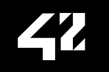

![Language: C][language-shield]
[![MIT License][license-shield]][license-url]
[![LinkedIn][linkedin-shield]][linkedin-url]

# HIVE Helsinki C piscine

[](https://42.fr/en/homepage/)
[](https://www.hive.fi/en/)

An intensive C programming and collaboration course in [HIVE Helsinki](https://www.hive.fi/en/) (part of [École 42](https://42.fr/en/homepage/)) completed in July 2022.

## Screenshots


## Features

- The tasks presented are done by myself / my group
- Everything is done according to the instructions
- Each day/task group resides in its own folder
- Each day/task requirement is listed under its own folder
- The syntax is following the [Norm [PDF]](en.norm.pdf)
- [rush00](rush00/), [rush01 (Sudoku)](rush01/) and [BSQ (Biggest square)](BSQ/) are group projects
- [EvalExpr](EvalExpr/) and [match-n-match](match-n-match/) are personal extra projects
## Tech Stack

Command line:

- Shell
- C
- Makefile

## Installation

Not required.
Though one has to compile the executables using e.g. `gcc`:

```bash
  > gcc *.c
```

or use the Makefile (if provided in the task folder):

```bash
  > make [re]
```

Then run the executable `a.out` by

```bash
  > ./a.out <parameters>
```

## Lessons Learned

- The nature of the HIVE (École 42) studies can be the best described by _"figure it out"_. Literally: no guidance, no lessons, no extra materials (except very rudimental ones). But one has to lean on the peer support and own skills: learning, time management, prioritisation.

- One has to accept that the tasks are quite often very vaguely defined, and at the same time they are checked very rigorously (as in the real workplace, I would guess).

- Official presentation on studies is [here](https://www.hive.fi/en/studies).

## License

Distributed under the [MIT License](./LICENSE).

<!-- MARKDOWN LINKS & IMAGES -->
[license-shield]: https://img.shields.io/github/license/andrejkurusiov/school-42-c-piscine?style=flat
[license-url]: ./LICENSE
[linkedin-shield]: https://img.shields.io/badge/LinkedIn-Profile-informational?style=flat&logo=linkedin
[linkedin-url]: https://www.linkedin.com/in/andrejkurusiov/
[language-shield]: https://img.shields.io/badge/language-C-brightgreen
